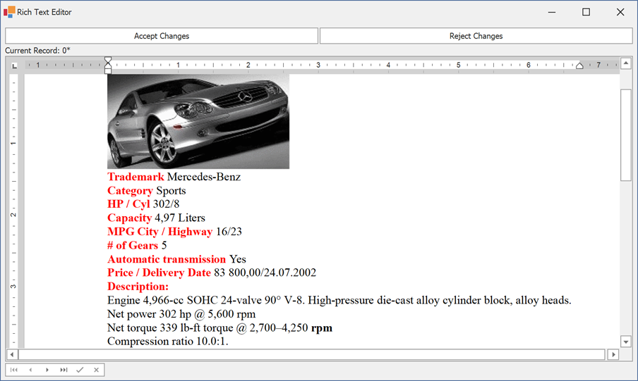

<!-- default badges list -->

<!-- default badges end -->
<!-- default file list -->
*Files to look at*:

* [Form1.cs](./CS/Form1.cs) (VB: [Form1.vb](./VB/Form1.vb))
* [Program.cs](./CS/Program.cs) (VB: [Program.vb](./VB/Program.vb))
<!-- default file list end -->
# How to use a RichEditControl in Bound Mode

This example illustrates how to bind the RichEditControl to an <b>Rtf</b> data column and handle <b>Rtf</b> content saving/loading operations (note that actual data is stored in the SQL Server database). The major aspects covered by this example are:

1) Choosing the SQL column data type for Rtf content. Most often, the <strong>varchar(max)</strong> type is sufficient for this purpose (note that <a href="http://en.wikipedia.org/wiki/Rich_Text_Format"><u>Rich Text Format</u></a> is an 8-bit format). See also: <a href="http://msdn.microsoft.com/en-us/library/bb386947.aspx"><u>SQL-CLR Type Mapping</u></a>.

2) Supporting two data persistence levels in the client application: control (RichEditControl) level and memory (DateSet) level. The first level is controlled by the Undo Manager of the RichEditControl. We utilize the <a href="https://docs.devexpress.com/WindowsForms/DevExpress.XtraRichEdit.RichEditControl.Modified">RichEditControl.Modified Property</a> to define the current state of this level. The changes at this level are accepted/rejected by the end-user via the <a href="https://docs.devexpress.com/WindowsForms/DevExpress.XtraEditors.DataNavigator">DataNavigator</a>. Memory level is maintained by the ADO.NET DataTable container. You can find more information on this subject in the <a href="https://learn.microsoft.com/en-us/dotnet/framework/data/adonet/dataset-datatable-dataview/row-states-and-row-versions">Row States and Row Versions</a> webpage. The changes at this level are accepted/rejected by the end-user via separate buttons above the RichEditControl.

The actual RichEditControl binding to the <strong>RtfContent</strong> column is established via the bindable <a href="https://docs.devexpress.com/WindowsForms/DevExpress.XtraRichEdit.RichEditControl.RtfText">RichEditControl.RtfText Property</a> in the Form1_Load event handler.

To test this example locally, you should setup "CarsDB" sample database in your SQL Server instance. Create a database with this name and utilize Script.sql file, attached with this example, to generate a sample table schema and data.

The picture below illustrates the sample in action.

 
